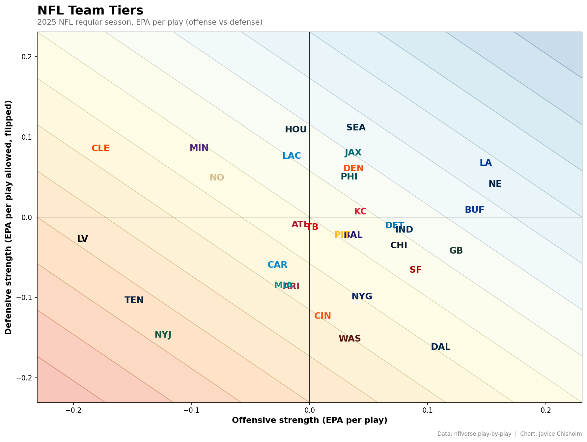

# Predicting NFL Game Outcomes with Logistic Regression

A self-directed classification project predicting NFL home team wins using pre-game information (point spread, rest days, weather, field conditions).

## Overview

Using Python, pandas, and scikit-learn, I built a logistic regression model to predict whether the home team would win an NFL game, based on a public dataset of every regular-season game since 1999.

## What I did

- Cleaned and filtered the dataset to completed regular-season games
- Identified and fixed a hidden data quality bug: inconsistent whitespace in the `surface` column (`"grass"` vs `"grass "`) was silently creating duplicate categories
- Engineered features from information available before kickoff (point spread, over/under, rest days, weather, field type)
- One-hot encoded categorical features and scaled numeric features
- Trained/tested with a stratified 80/20 split
- Evaluated using accuracy, a confusion matrix, precision/recall, and ROC/AUC

## Results

- **Accuracy:** 64.6% on held-out test data
- **ROC AUC:** 0.70

These results reflect performance on historical games the model was not trained on — not predictions of future or live games.

## Team Strength Visualization

Recreated rbsdm.com-style team tier charts (overall, rushing, passing) from nflverse play-by-play data — computing EPA per play for each team's offense and defense across the 2025 season.

## How to run

Open `Predicting_NFL_games.ipynb` in Jupyter and run all cells — data loads directly from public URLs, no downloads needed.

## Tools

Python, pandas, scikit-learn, matplotlib, seaborn, Jupyter Notebook

## Data source

[nflverse/nfldata](https://github.com/nflverse/nfldata) — public NFL game data, 1999–present
